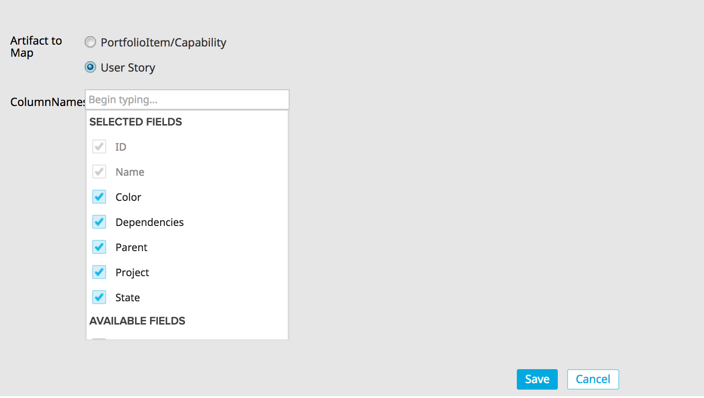
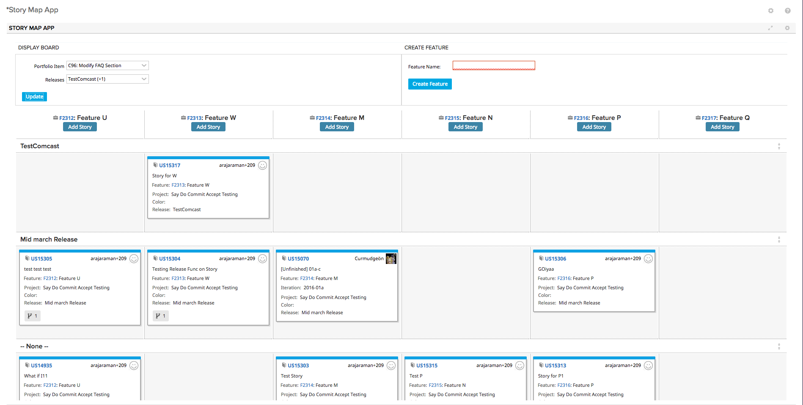
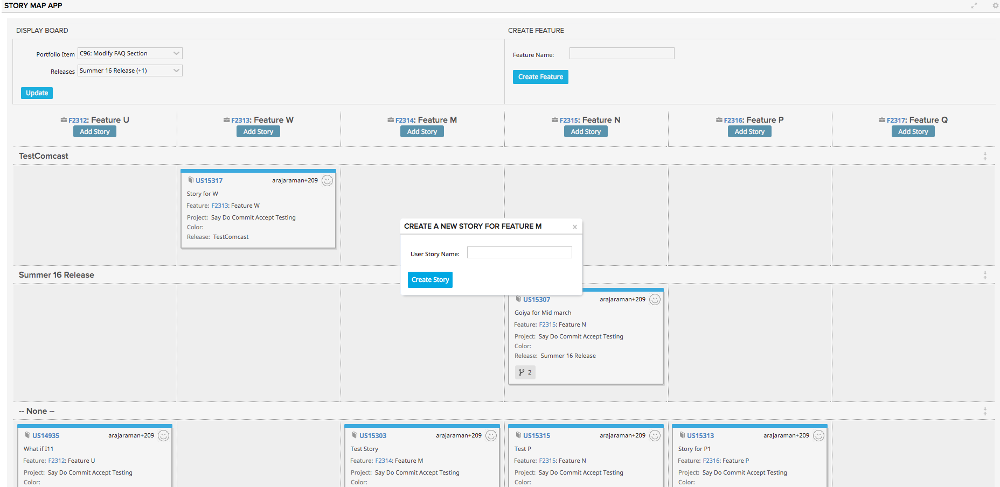

# Story Map App

This application helps users to do Story mapping or 2nd Level PI Mapping.
- Lets the user choose the artifact type (Story or 2nd Level PI) on app settings.
- If story is selected, lists all User Stories that belong to a specific 2nd Level PI and a set of Releases on a cardboard
- The column represents the Feature that the Story belongs to.
- Includes Release Swimlanes
- Lets user create a Feature
- Lets user create a Story under a specific feature using the Add Story Button.
- Allows dragging of cards across columns (features) or rows (releases).

Users will be able to choose the artifact type and the fields that should appear on the card.

#### Steps to install the Application
 1. On your dashboard, click on the gear to add an app.
 2. Choose "Custom HTML" from the App Catalog. Add the app.
 3. Paste the code to HTML text area from the link - https://raw.githubusercontent.com/RallyTechServices/story-map-app/master/deploy/App.txt
 4. Click Save.

#### Steps to get started:
 1. Once the application is installed, click on the gear on top right corner of the app to open App Settings and choose the 2nd Level PI Type and the fields that should appear on the card.
 2. Save app settings.
 3. Select a PI.
 4. Select Releases and Click Update.
 5. Type in a Feature name and click on Create Feature.
 6. Click on Add Story to add a story under each Feature.

## Development Notes

* This cardboard uses both Rally.ui.cardboard.plugin.Scrollable and Rally.ui.cardboard.plugin.CollapsibleColumns.  These plugins weren't built to work together.  This code includes an override to handle recalculating the number of columns to display when columns have been collapsed and uncollapsed.  (It's a small hack; there is a timer because the width of the app is recalculated after the last event that we can capture after a column is hidden -- so we wait a moment and check width again.)

### First Load

If you've just downloaded this from github and you want to do development,
you're going to need to have these installed:

 * node.js
 * grunt-cli
 * grunt-init

Since you're getting this from github, we assume you have the command line
version of git also installed.  If not, go get git.

If you have those three installed, just type this in the root directory here
to get set up to develop:

  npm install

### Structure

  * src/javascript:  All the JS files saved here will be compiled into the
  target html file
  * src/style: All of the stylesheets saved here will be compiled into the
  target html file
  * test/fast: Fast jasmine tests go here.  There should also be a helper
  file that is loaded first for creating mocks and doing other shortcuts
  (fastHelper.js) **Tests should be in a file named <something>-spec.js**
  * test/slow: Slow jasmine tests go here.  There should also be a helper
  file that is loaded first for creating mocks and doing other shortcuts
  (slowHelper.js) **Tests should be in a file named <something>-spec.js**
  * templates: This is where templates that are used to create the production
  and debug html files live.  The advantage of using these templates is that
  you can configure the behavior of the html around the JS.
  * config.json: This file contains the configuration settings necessary to
  create the debug and production html files.  
  * package.json: This file lists the dependencies for grunt
  * auth.json: This file should NOT be checked in.  Create this to create a
  debug version of the app, to run the slow test specs and/or to use grunt to
  install the app in your test environment.  It should look like:
    {
        "username":"you@company.com",
        "password":"secret",
        "server": "https://rally1.rallydev.com"
    }

### Usage of the grunt file
####Tasks

##### grunt debug

Use grunt debug to create the debug html file.  You only need to run this when you have added new files to
the src directories.

##### grunt build

Use grunt build to create the production html file.  We still have to copy the html file to a panel to test.

##### grunt test-fast

Use grunt test-fast to run the Jasmine tests in the fast directory.  Typically, the tests in the fast
directory are more pure unit tests and do not need to connect to Rally.

##### grunt test-slow

Use grunt test-slow to run the Jasmine tests in the slow directory.  Typically, the tests in the slow
directory are more like integration tests in that they require connecting to Rally and interacting with
data.

##### grunt deploy

Use grunt deploy to build the deploy file and then install it into a new page/app in Rally.  It will create the page on the Home tab and then add a custom html app to the page.  The page will be named using the "name" key in the config.json file (with an asterisk prepended).

To use this task, you must create an auth.json file that contains the following keys:
{
    "username": "fred@fred.com",
    "password": "fredfredfred",
    "server": "https://us1.rallydev.com"
}

(Use your username and password, of course.)  NOTE: not sure why yet, but this task does not work against the demo environments.  Also, .gitignore is configured so that this file does not get committed.  Do not commit this file with a password in it!

When the first install is complete, the script will add the ObjectIDs of the page and panel to the auth.json file, so that it looks like this:

{
    "username": "fred@fred.com",
    "password": "fredfredfred",
    "server": "https://us1.rallydev.com",
    "pageOid": "52339218186",
    "panelOid": 52339218188
}

On subsequent installs, the script will write to this same page/app. Remove the
pageOid and panelOid lines to install in a new place.  CAUTION:  Currently, error checking is not enabled, so it will fail silently.

##### grunt watch

Run this to watch files (js and css).  When a file is saved, the task will automatically build and deploy as shown in the deploy section above.
